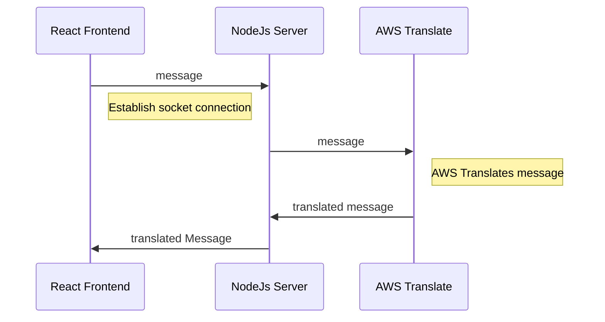

## aws_socket_react_chat

## Requirements

 1. User is able to select native language and target language
 2. Messages are translated from native language to target language via AWS Translate
 3. User is able to upload a document which translated to target language
 4. Real-time chat capability using Socket.io

## Demo

## System diagram

## Instruction

1. git clone this repo
2. cd backend
3. npm install
4. node server.js
5. cd frontend
6. npm install
7. npm start

Login Info: 
1. test@gmail.com - 12345678
2. test2@gmail.com - 12345678

